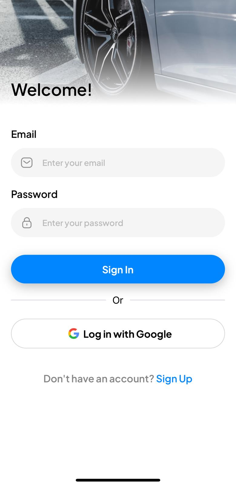

0# 🚖 Uber Clone App

An Uber-like mobile application built with **React Native** that allows users to book rides and make payments seamlessly. This project integrates key technologies like **PostgreSQL**, **TypeScript**, **Stripe**, **TailwindCSS**, **Maps API**, and **OAuth** for a full-stack experience.

## 🛠 Features

- **User Authentication**: Secure login and signup using OAuth (Google, Facebook, etc.) via the Clerk or Auth0.
- **Payment Integration**: Seamless payments using Stripe for in-app transactions.
- **Ride Booking**: Book rides from point A to point B with real-time fare estimates.
- **Driver Matching**: Users are matched with nearby drivers using optimized algorithms.
## 📱 Screenshots

<p align="center">
  
  
</p>
<p align="center">
  <em>Welcome Screen</em> &nbsp;&nbsp;&nbsp;&nbsp;&nbsp;&nbsp;&nbsp;&nbsp;
  <em>Login Screen</em>
</p>

<p align="center">
  
  
  
</p>
<p align="center">
  <em>Home Screen</em> &nbsp;&nbsp;&nbsp;&nbsp;&nbsp;&nbsp;&nbsp;&nbsp;
  <em>Select Driver Screen</em> &nbsp;&nbsp;&nbsp;&nbsp;&nbsp;&nbsp;&nbsp;&nbsp;
  <em>Payment Screen</em>
</p>


## 🚀 Getting Started

Follow these steps to get a copy of the project up and running locally.

### Prerequisites

Ensure you have the following installed:

- **Node.js** (v14+)
- **Expo CLI** (latest)
- **PostgreSQL** (for the backend)
- **Stripe Account** (for payments)
- **Google Maps API Key**

### Installation

1. **Clone the repository**:

   ```bash
   git clone https://github.com/your-username/uber-clone-app.git
   cd uber-clone-app


### Inspired By
JavaScirpt Mastery (JSM) tutorial
